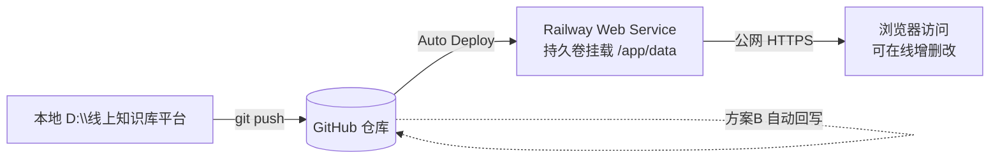

# 太阳系 3D 知识库（Solar Knowledge Base）

一个跑在浏览器里的**太阳系**：太阳居中，每颗行星代表一个知识分类，每颗卫星代表一本「书」或一条「知识点」。行星按真实公转节奏绕日运行，点击行星聚焦并展开其卫星，点击卫星即可阅读 Markdown 内容。所有数据可在线增删改，支持公网部署与持久化。

> 仓库：`github.com/lhbin-8888/solar-knowledge`（镜像：`gitee.com/luo-huaibin/solar-knowledge`）

---

## 一、功能特性

- **3D 太阳系**：Three.js 实现太阳 + 行星公转 + 轨道线 + 星空背景，鼠标拖拽旋转、滚轮缩放。
- **银河蓝紫星空**：加色混合的星际云团 + 北斗七星（带连线）+ 缓慢闪烁的圆形星点（已修复方块 bug）。
- **行星 = 分类**：当前 14 个分类（社会学、心理学、历史、人物传记、哲学与宗教、政治军事、金融理财、经营管理、小说、艺术、文学、医学健康、生活百科、诗歌散文）。*已删除「科学技术」「其他」两类。*
- **卫星 = 书籍/知识点**：每颗行星周围有发光卫星环绕，点击打开阅读弹窗（Markdown 渲染）。
- **管理后台**：右上角「⚙ 管理」可在线 **新增/删除分类**、**新增/编辑/删除卫星**（书名、作者、简介、标签、封面、正文）。
- **搜索 + 标签筛选**：顶部搜索框（书名/作者/简介/标签）+ 标签 chip 多选，跨分类筛选。
- **自动封面**：不填封面时按分类色生成渐变封面；也可放图到 `data/books/covers/` 引用。
- **离线兜底**：Three.js / OrbitControls / marked 全部本地化，无外网也能跑（断网时读 `js/seed.js`）。

---

## 二、技术架构

| 层 | 技术 | 说明 |
| --- | --- | --- |
| 前端 | Three.js 0.160（本地化）+ 原生 JS | `index.html` / `css/` / `js/main.js`，importmap 加载 three |
| 后端 | Python 标准库 `http.server` | `server.py`，零第三方依赖，提供静态服务 + REST API |
| 数据 | JSON + Markdown | `data/knowledge.json`（元数据）+ `data/books/<分类>/<id>.md`（正文） |
| 部署 | Docker（Railway / Render / Fly.io） | 纯标准库，无构建步骤 |

---

## 三、目录结构

```
D:\线上知识库平台\
├── index.html              # 入口页
├── css/style.css           # 样式（含行星标签、弹窗、管理后台）
├── js/
│   ├── main.js             # 3D 引擎 + 交互 + 管理逻辑
│   └── seed.js             # 离线兜底数据（14 类 18 本）
├── assets/js/              # 本地化 three.module.js / OrbitControls.js / marked.min.js
├── data/                   # 数据根（持久化核心）
│   ├── knowledge.json      # 元数据（不含正文）
│   └── books/<分类>/<id>.md # 每本书正文
├── server.py               # 后端服务 + API + 方案B自动git回写
├── start.bat               # 本地一键启动（双击）
├── Dockerfile / railway.json / render.yaml / fly.toml  # 部署配置
├── requirements.txt        # 空依赖（仅占位）
└── tools/                  # 种子/迁移/打包脚本
```

---

## 四、本地运行

**方式一（推荐）**：双击 `start.bat`，浏览器打开 `http://127.0.0.1:8000`。

**方式二（命令行）**：
```bash
cd D:\线上知识库平台
python server.py          # 或指定端口： PORT=9000 python server.py
```
> ⚠️ 必须经本地服务访问，**不要直接双击 `index.html`** —— ES module + importmap 在 `file://` 下会被浏览器 CORS 拦截。

管理后台：浏览器右上角「⚙ 管理」→ 选分类 → 填表 → 保存。改动**实时写入 `data/`**，可随时备份整个 `data/` 目录。

---

## 五、数据持久化方案（B + C 双保险）

本仓库采用两套互补的持久化机制，确保「公网新增/修改的内容永久不丢」。

- **方案 C — 持久卷（主）**：部署平台挂一块持久磁盘到 `DATA_ROOT`（默认 `D:\线上知识库平台\data`；Railway 挂 `/app/data`；Fly.io 挂 `/app/data`）。运行期所有增删改都落在这块卷上，实例重启不丢。
- **方案 B — 自动 git 回写（兜底）**：后端每次增删改后，后台线程自动 `git add data && commit && push` 回 GitHub 仓库；启动时 `git pull --rebase` 恢复。所有 git 失败**容忍、绝不阻断请求**。

二者互为兜底：卷丢了可从仓库恢复，仓库不可达也不影响在线编辑。

---

## 六、公网部署

### 方案 A：Railway（推荐，含持久卷，全功能）



1. 打开 [railway.app](https://railway.app) → 用 GitHub 登录。
2. **New Project → Deploy from GitHub repo** → 选 `solar-knowledge`（仓库已含 `railway.json`，自动用 Dockerfile 构建、挂卷到 `/app/data`、端口 8000）。
3. 点 **Deploy**，约 1 分钟得到 `https://solar-knowledge-xxxx.up.railway.app` 公网地址。
4. （可选双保险）Railway 项目 **Variables** 加 `GITHUB_PUSH_URL = https://<token>@github.com/lhbin-8888/solar-knowledge.git`，启用方案 B。

### 方案 B：Render（备选，免费层需方案 B 才持久）

1. [render.com](https://render.com) → New → Web Service → 连 GitHub `solar-knowledge`。
2. Render 读取 `render.yaml` 自动配置。**免费层 15 分钟休眠且磁盘重置**，因此**必须**配置 `GITHUB_PUSH_URL` 环境变量（方案 B 是其唯一持久化手段）。

### 方案 C：Gitee Pages（仅静态浏览，不能增删改）

适合「只浏览、不编辑」的国内镜像场景。需把前端改为纯静态（去掉 `server.py` 依赖，数据走 `js/seed.js`）。本仓库默认形态是「全功能 + 后端」，Pages 仅作展示备份。

---

## 七、环境变量

| 变量 | 默认值 | 说明 |
| --- | --- | --- |
| `PORT` | `8000` | 服务监听端口 |
| `HOST` | `0.0.0.0` | 监听地址（本地可设 `127.0.0.1`） |
| `DATA_ROOT` | `<仓库>/data` | 数据根；部署时指向持久卷 |
| `GITHUB_PUSH_URL` | 空 | 方案 B 回写地址（`https://<token>@github.com/...`）；为空则跳过回写 |

---

## 八、REST API 速查

| 方法 | 路径 | 说明 |
| --- | --- | --- |
| GET | `/api/data` | 读取全部知识树（正文由 `.md` 内联） |
| POST | `/api/category` | 新增分类（行星），返回新对象（含自动 id/轨道） |
| POST | `/api/category/<id>/satellite` | 给某分类新增卫星（书籍） |
| PUT | `/api/satellite/<id>` | 修改卫星 |
| DELETE | `/api/satellite/<id>` | 删除卫星 |
| DELETE | `/api/category/<id>` | 删除整个分类（连带书籍目录） |

> 静态服务仅白名单暴露 `assets/ css/ js/ data/books/ index.html`；`data/knowledge.json`、`server.py`、`tools/` 不可直接访问（403）。

---

## 九、备份与恢复

- **备份**：直接拷贝 `data/` 整个目录即可（含 JSON 与全部 `.md`）。
- **恢复**：把备份的 `data/` 覆盖回去，重启服务。
- **仓库即备份**：方案 B 已把 `data/` 实时回写 GitHub，仓库历史即完整时间机器。

---

## 十、开发与维护

- 改某本书：直接编辑 `data/books/<分类>/<id>.md`（Markdown），无需进后台。
- 改后端：改完重启服务即可（Python 标准库，无需安装依赖）。
- 重新生成离线兜底 `seed.js`：`python tools/regen_seed.py`（从线上 `data/` 反推）。
- 端口被旧进程占用：结束占用 8000 的进程后再启动。

---

**License**：自用知识库，数据归用户所有。
